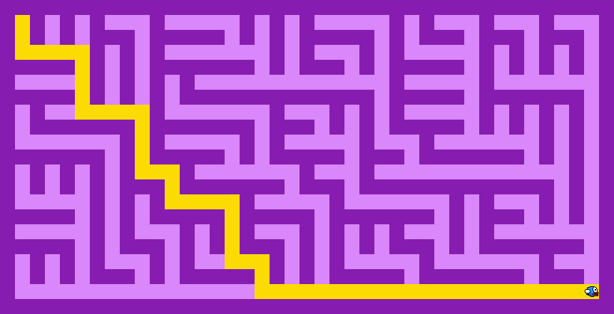

# Генерация и решение лабиринта

## Описание работы

Данная программа генерирует лабиринт с помощью алгоритма двоичного дерева. 
А также определяет кратчайший путь от его начальной до конечной клетки 
на основе алгоритма Левита.

<p align="center">
  
</p>

## Запуск программы

Генерация и решение лабиринта с заданным числом ячеек:

```cmd
python main.py -wh 20 10 -sol 
```
Считывание лабиринта из текстового файла:
```cmd
python main.py -lmt maze_text/array.txt -sol
```
Считывание лабиринта из изображения:
```cmd
python main.py -lmi maze_image/n_maze.png  
```
